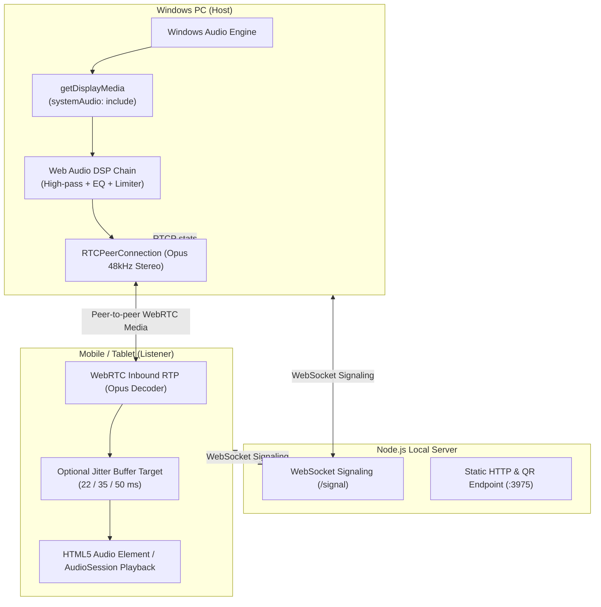

# Wifora Architecture & Engineering Deep-Dive

This document details the internal architecture, mathematical formulations, signaling protocols, and audio processing pipelines powering Wifora.

---

## 1. System Overview

Wifora is a local WebRTC audio application with a Node.js signaling server and browser-side audio processing:

- **Host (Windows PC)**: Uses the browser's `getDisplayMedia({ audio: true, systemAudio: 'include' })` capture path by default. The optional native path uses WASAPI loopback, binary framed Float32 PCM over a localhost WebSocket, a short resampling worklet buffer, then the same browser-side Web Audio and WebRTC path.
- **Signaling Hub (Node.js Server)**: Serves the static UI and QR endpoint, then relays WebSocket signaling messages for room registration, authentication, ICE candidates, and SDP offers/answers. Media does not pass through the server.
- **Listener (Mobile / Secondary Device)**: Receives the peer-to-peer Opus RTP stream in the browser, plays it through an HTML5 Audio element, optionally adjusts `RTCRtpReceiver.jitterBufferTarget`, and displays Web Audio telemetry.



The native relay deliberately remains host-local: raw PCM never traverses the Wi-Fi network. Its source queue is capped at eight capture packets, the browser starts after two packets and drops stale packets above a short ceiling. This bounds capture-to-encoder delay rather than allowing a transient stall to accumulate into audible lag. The worklet resamples the fixed 48 kHz helper output to the actual `AudioContext` rate so a 44.1 kHz output device cannot change pitch or introduce artifacts.

Signaling reconnection is session-based. A listener re-registers with its persistent session id and the host with its authenticated room key; abnormal host signaling disconnects receive an 8-second grace window. A clean user stop still closes the room immediately.

---

## 2. Web Audio DSP Pipeline

Before transmission, the captured audio stream passes through a specialized Web Audio DSP graph running at 48 kHz:

```
[System Audio Input]
        │
        ▼
[BiquadFilterNode: Highpass (20 Hz, Q=0.707)]  ──> Eliminates DC offset & sub-audible mechanical rumble
        │
        ▼
[BiquadFilterNode: Peaking EQ (3.2 kHz, 0 dB default, Q=1.0)] ──> Optional voice-mode presence boost
        │
        ▼
[DynamicsCompressorNode: Studio Peak Limiter]   ──> Transparent compressor (threshold -1 dB, knee 3 dB, ratio 12:1)
        │
        ├───> [GainNode (Volume/Mute)] ───> [MediaStreamAudioDestinationNode] ───> WebRTC RTP Sender
        │
        └───> [AnalyserNode (FFT Size 128)] ───> requestAnimationFrame UI Level Meter
```

### Limiter Specification

- **Default clarity mode**: threshold `-1.0 dBFS`, knee `3 dB`, ratio `12:1`
- **Voice mode**: threshold `-1.5 dBFS`, knee `2.5 dB`, ratio `8:1`, with an `80 Hz` high-pass and `+3.5 dB` presence boost
- **Pure mode**: high-pass moved to `1 Hz`, EQ gain `0 dB`, compressor effectively bypassed with threshold `0 dB` and ratio `1:1`
- **Attack Time**: `1 ms` (Instantaneous transient catching)
- **Release Time**: `40 ms` in clarity/pure mode and `50 ms` in voice mode

---

## 3. WebRTC Opus SDP Configuration

Wifora programmatically customizes the WebRTC Session Description Protocol (SDP) `a=fmtp` attributes for the Opus payload:

```text
a=fmtp:111 minptime=10;ptime=20;maxptime=20;useinbandfec=1;usedtx=0;stereo=1;sprop-stereo=1;maxaveragebitrate=256000;maxplaybackrate=48000
```

| Parameter                 | Value            | Rationale                                                                                                                                                     |
| :------------------------ | :--------------- | :------------------------------------------------------------------------------------------------------------------------------------------------------------ |
| `ptime` / `maxptime`      | `20`             | 20 ms framing halves packet overhead compared to 10 ms framing, dramatically reducing 802.11 MAC contention while maintaining sub-frame latency.              |
| `minptime`                | `10`             | Permits 10 ms lower bound if receiver requests it.                                                                                                            |
| `useinbandfec`            | `1`              | Forward Error Correction embeds redundant lower-bitrate payload for the previous frame inside each packet, correcting isolated RF drops without NACK latency. |
| `usedtx`                  | `0`              | Discontinuous Transmission is disabled to eliminate the 20–40 ms attack delay when music resumes after silence.                                               |
| `stereo` / `sprop-stereo` | `1`              | Full two-channel stereo spatial encoding.                                                                                                                     |
| `maxaveragebitrate`       | `96000`–`384000` | Adaptive mode ranges from 96–256 kbps; manual profiles can select 96, 160, or 384 kbps.                                                                       |
| `maxplaybackrate`         | `48000`          | Native 48 kHz fullband sampling rate.                                                                                                                         |

---

## 4. ANAE (Adaptive Network & Audio Engine)

The host ANAE loop monitors each peer every 1,000 ms using standard WebRTC `getStats()` metrics. The listener runs a separate 1,000 ms telemetry loop for its display and jitter-buffer target.

### Differential Packet Loss Formulation

The host compares outbound packets sent with the remote inbound `packetsLost` counter over the last sampling window $\Delta t = 1\,\text{s}$:

$$\Delta\text{PacketsReceived} = \text{PacketsReceived}_t - \text{PacketsReceived}_{t-1}$$

$$\Delta\text{PacketsLost} = \text{PacketsLost}_t - \text{PacketsLost}_{t-1}$$

$$
\text{InstantLoss}_{host} =
\begin{cases}
\dfrac{\Delta\text{PacketsLost}}{\Delta\text{PacketsSent}} \times 100\% & \text{if } \Delta\text{PacketsSent} > 0 \\
\text{stale / unavailable} & \text{otherwise}
\end{cases}
$$

The listener has both received and lost counters, so it uses the more conventional received-plus-lost denominator:

$$
\text{InstantLoss}_{listener} =
\begin{cases}
\dfrac{\Delta\text{PacketsLost}}{\Delta\text{PacketsReceived} + \Delta\text{PacketsLost}} \times 100\% & \text{if } \Delta\text{PacketsReceived} + \Delta\text{PacketsLost} > 0 \\
\text{unavailable} & \text{otherwise}
\end{cases}
$$

### EWMA Telemetry Smoothing

Transient RF interference is filtered using Exponentially Weighted Moving Averages (EWMA):

$$\text{SmoothedRTT}_t = \alpha_{\text{RTT}} \cdot \text{RTT}_t + (1 - \alpha_{\text{RTT}}) \cdot \text{SmoothedRTT}_{t-1} \quad (\alpha_{\text{RTT}} = 0.3)$$

$$\text{SmoothedLoss}_t = \alpha_{\text{Loss}} \cdot \text{InstantLoss}_t + (1 - \alpha_{\text{Loss}}) \cdot \text{SmoothedLoss}_{t-1} \quad (\alpha_{\text{Loss}} = 0.4)$$

RTT and jitter use the same smoothing helper with weight `0.3`; packet loss uses `0.4`.

### Dynamic Quality Tiers

| Tier  | Profile Name       | Bitrate  | Max Target RTT | Max Loss Rate | Max Jitter |
| :---: | :----------------- | :------: | :------------: | :-----------: | :--------: |
| **5** | Studio Master      | 256 kbps |    < 25 ms     |    < 0.2%     |   < 4 ms   |
| **4** | Studio High        | 224 kbps |    < 50 ms     |    < 0.8%     |   < 8 ms   |
| **3** | Balanced Standard  | 160 kbps |    < 85 ms     |    < 1.8%     |  < 15 ms   |
| **2** | Anti-Lag Resilient | 128 kbps |    < 120 ms    |    < 4.0%     |  < 25 ms   |
| **1** | Ultra-Resilient    | 96 kbps  |    Fallback    |   Fallback    |  Fallback  |

### Anti-Flapping Hysteresis State Machine

- **Fast-Down (Degradation)**: An RTT of at least 200 ms or an instantaneous loss of at least 10% is treated as severe and drops the tier immediately. Other downward changes require 2 consecutive samples targeting the same lower tier.
- **Smooth-Up (Recovery)**: Step-up to higher bitrates requires **5 consecutive stable cycles** (5 seconds) to ensure the Wi-Fi link has genuinely recovered.
- **Initial state**: Adaptive mode starts at Tier 3 (160 kbps) and can move one tier upward after each 5-cycle recovery step.

### Per-client Transport Policy

Every sender owns an independent `TransportPolicy`: a degraded listener therefore lowers only its own encoder bitrate, rather than penalising the other peers. Runtime bitrate changes use `RTCRtpSender.setParameters`; profile and negotiated codec settings are generated into the initial SDP and any subsequent ICE-restart offer. The policy keeps FEC enabled for explicit user profiles and for adaptive resilience tiers, uses 10 ms packetisation for the low-latency profile (20 ms otherwise), disables DTX to preserve a continuous music timeline, and switches to mono only in the most degraded adaptive tier.

---

## 5. Receiver Jitter Buffer & Lifecycle Watchdog

1. **Adaptive Jitter Buffer Target**: On browsers supporting `RTCRtpReceiver.jitterBufferTarget`, the listener uses an explicit controller with **Ultra Low (22 ms)**, **Balanced (35 ms)**, **Stable (50 ms)**, and **Recovery (65 ms)** modes. It considers smoothed RTT, jitter, loss, optional buffer occupancy, late frames, underruns, and clock drift. Degradation is fast (immediate for underflow/burst conditions); reductions require multiple stable samples to avoid flapping. Unsupported browsers leave the browser default unchanged.
2. **Tab Visibility & Standby Recovery**: `visibilitychange`, `pageshow` (bfcache), `online`, and `focus` events wake up the WebRTC track, resume suspended `AudioContext` instances, and verify WebSocket heartbeat liveliness.
3. **iOS Audio Routing**: Sets `navigator.audioSession.type = 'playback'` to prevent iOS from routing playback through the telephony earpiece.
4. **Screen Wake Lock**: Activates the Screen Wake Lock API to prevent mobile displays from sleeping while streaming.

---

## 6. Clock Drift Estimation

The transport-independent audio core now includes a `DriftController`. A transport reports pairs of remote and local monotonic sample timestamps; the controller derives their rate difference in parts per million (ppm), smooths valid observations, and exposes a deliberately bounded `playbackRate` correction.

This avoids using buffer growth as a clock-drift workaround. Discontinuous, reversed, or implausibly large observations are rejected, leaving the prior correction intact.

### Multi-device clock exchange

Each listener now runs a five-second NTP-style `clock.sync` exchange with the host. The four timestamps (`clientSentAt`, `hostReceivedAt`, `hostSentAt`, `clientReceivedAt`) estimate host-minus-listener offset and round-trip time. The listener smooths successive offset samples into a drift estimate, caps the correction to ±100 ppm, and applies the resulting `HTMLMediaElement.playbackRate` only as a browser best effort. Safari and other browsers may keep their native WebRTC playout rate; the estimator and diagnostics still remain available.

The server validates the clock message schema and routes probes/reports only to the room host and replies only to the target listener. The host dashboard exposes each listener's measured sync offset. Two or more real devices are still required to establish the roadmap's final measured-sync completion criterion.

---

## 7. Versioned Control Protocol

Control messages are independent of WebRTC media and use the bounded envelope `{ type, version, sessionId, deviceId, timestamp, payload }`. Version `1` supports session/device notifications, audio policy changes, listener telemetry, network state and ICE-restart coordination. The server validates the version, identities, timestamp and payload size before routing a message within its authenticated room. Listener telemetry is relayed only to its room host; browser media remains peer-to-peer.

The listener reports its smoothed RTT, jitter, loss, average browser playout delay, audio state, visibility and selected jitter target once per second. While this telemetry is fresh (four seconds), the host feeds the worst of its local WebRTC measurement and the listener's measurement to that listener's `TransportPolicy`, so a degraded device does not affect the other peers. `audio.policy` is host-only, has a strict bitrate/FEC/stereo/ptime schema, and is routed solely to the listener whose `sessionId` it names.

---

## 8. Multi-Device Synchronization & Alignment

Wifora coordinates multi-device playback synchronization via `MultiDeviceSyncController`:

- **NTP-Style 4-Timestamp Exchange**: Computes accurate clock offsets and round-trip times without requiring global GPS or specialized local clock hardware.
- **Group Sync Spread Metric (`syncSpreadMs`)**: Measures the difference between the most leading and most lagging listener.
- **Micro-Rate Playout Guidance**: Recommends rate offsets within ±100 ppm to bring lagging or leading receivers into alignment with the group mean without audible pitch artifacts.

---

## 9. Modular Audio Transport & AirPlay Backend

The `AudioEngine` is fully decoupled from specific network transports via the abstract `AudioTransport` interface (`src/transport/base.mjs`):

- **`WebRtcAudioTransport`**: Standard peer-to-peer browser transmission.
- **`AirPlayAudioTransport`**: isolated RAOP/RTSP state-machine and RTP packetization prototype, covered by unit tests. It does not open RTSP/UDP sockets, implement ALAC, Apple pairing/FairPlay, encryption, or AirPlay 2 discovery; it must not be advertised as compatible with Apple AirPlay devices yet.

---

## 10. Native iOS Receiver Architecture

For environments requiring background playback beyond Safari's browser limits, the `WiforaReceiverKit` Swift package (`native/ios/`) provides:

- **`WiforaAudioSession`**: Native `AVAudioSession` category `.playback` with background audio preservation, route change listener (AirPods disconnect pauses/resumes), and 10 ms IO buffer duration.
- **`WiforaSignalingClient`**: Direct URLSession WebSocket client communicating via Wifora Control Protocol v1.
- **`WiforaClockSync`**: Native Swift 4-timestamp NTP clock sync engine.

The package is not yet an installable receiver: it has no WebRTC peer implementation, SDP/candidate application, Opus decoder, or audio renderer. Those pieces are required before it can play a Wifora stream on iOS.
