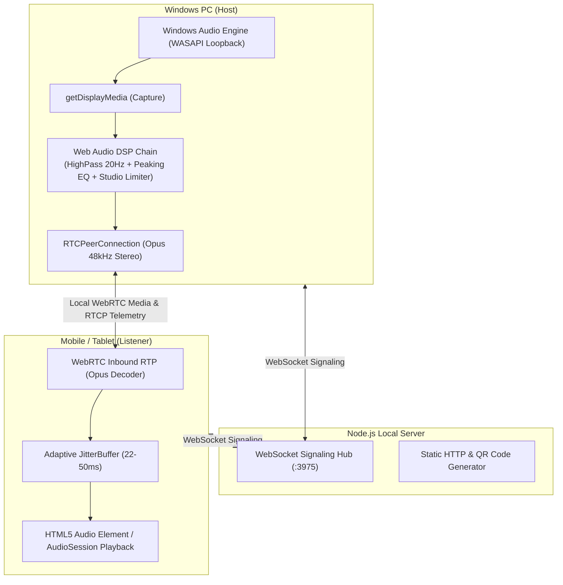

# Wifora Architecture & Engineering Deep-Dive

This document details the internal architecture, mathematical formulations, signaling protocols, and audio processing pipelines powering Wifora.

---

## 1. System Overview

Wifora operates as a hybrid local WebRTC audio server and Web Audio DSP engine:
- **Host (Windows PC)**: Captures system loopback audio via `navigator.mediaDevices.getDisplayMedia({ audio: true, systemAudio: 'include' })`, applies transparent studio DSP mastering (anti-rumble, dialog clarity, soft-knee peak limiter), encodes with Opus 48 kHz stereo (20 ms framing, in-band FEC), and acts as WebRTC peer sender.
- **Signaling Hub (Node.js Server)**: Lightweight local WebSocket server managing room state, host authentication, client lifecycle, and ICE SDP exchange.
- **Listener (Mobile / Secondary Device)**: Pure in-browser WebRTC receiver decoding the incoming Opus RTP stream into an HTML5 Audio element with dynamic jitter buffer adaptation, AudioSession media routing, and real-time Web Audio FFT level metering.



---

## 2. Web Audio DSP Pipeline

Before transmission, the captured audio stream passes through a specialized Web Audio DSP graph running at 48 kHz:

```
[System Audio Input]
        │
        ▼
[BiquadFilterNode: Highpass (20 Hz, Q=0.707)]  ──> Eliminates DC offset & sub-audible mechanical rumble
        │
        ▼
[BiquadFilterNode: Peaking EQ (3.2 kHz, +1.8 dB, Q=1.0)] ──> Enhances dialogue articulation & presence
        │
        ▼
[DynamicsCompressorNode: Studio Peak Limiter]   ──> Transparent soft-knee limiter (threshold -0.5 dB, ratio 20:1)
        │
        ├───> [GainNode (Volume/Mute)] ───> [MediaStreamAudioDestinationNode] ───> WebRTC RTP Sender
        │
        └───> [AnalyserNode (FFT Size 64)] ───> 60 FPS UI Peak VU Meter
```

### Limiter Specification
- **Threshold**: `-0.5 dBFS`
- **Knee**: `4 dB` (Smooth curve transition)
- **Ratio**: `20:1` (Brickwall limiting)
- **Attack Time**: `1 ms` (Instantaneous transient catching)
- **Release Time**: `40 ms` (Clean recovery without audible pumping)

---

## 3. WebRTC Opus SDP Configuration

Wifora programmatically customizes the WebRTC Session Description Protocol (SDP) `a=fmtp` attributes for the Opus payload:

```text
a=fmtp:111 minptime=10;ptime=20;maxptime=20;useinbandfec=1;usedtx=0;stereo=1;sprop-stereo=1;maxaveragebitrate=256000;maxplaybackrate=48000
```

| Parameter | Value | Rationale |
| :--- | :--- | :--- |
| `ptime` / `maxptime` | `20` | 20 ms framing halves packet overhead compared to 10 ms framing, dramatically reducing 802.11 MAC contention while maintaining sub-frame latency. |
| `minptime` | `10` | Permits 10 ms lower bound if receiver requests it. |
| `useinbandfec` | `1` | Forward Error Correction embeds redundant lower-bitrate payload for the previous frame inside each packet, correcting isolated RF drops without NACK latency. |
| `usedtx` | `0` | Discontinuous Transmission is disabled to eliminate the 20–40 ms attack delay when music resumes after silence. |
| `stereo` / `sprop-stereo` | `1` | Full two-channel stereo spatial encoding. |
| `maxaveragebitrate` | `96000`–`384000` | Dynamically adjusted by ANAE or manual profile selection. |
| `maxplaybackrate` | `48000` | Native 48 kHz fullband sampling rate. |

---

## 4. ANAE (Adaptive Network & Audio Engine)

ANAE continuously monitors transport health every 1,000 ms using standard WebRTC `getStats()` metrics.

### Differential Packet Loss Formulation
Rather than computing cumulative loss over the connection's lifetime, ANAE calculates differential loss over the last sampling window $\Delta t = 1\,\text{s}$:

$$\Delta\text{PacketsReceived} = \text{PacketsReceived}_t - \text{PacketsReceived}_{t-1}$$

$$\Delta\text{PacketsLost} = \text{PacketsLost}_t - \text{PacketsLost}_{t-1}$$

$$\text{InstantLoss} = \begin{cases} \dfrac{\Delta\text{PacketsLost}}{\Delta\text{PacketsReceived} + \Delta\text{PacketsLost}} \times 100\% & \text{if } (\Delta\text{PacketsReceived} + \Delta\text{PacketsLost}) > 0 \\ 0\% & \text{otherwise} \end{cases}$$

### EWMA Telemetry Smoothing
Transient RF interference is filtered using Exponentially Weighted Moving Averages (EWMA):

$$\text{SmoothedRTT}_t = \alpha_{\text{RTT}} \cdot \text{RTT}_t + (1 - \alpha_{\text{RTT}}) \cdot \text{SmoothedRTT}_{t-1} \quad (\alpha_{\text{RTT}} = 0.3)$$

$$\text{SmoothedLoss}_t = \alpha_{\text{Loss}} \cdot \text{InstantLoss}_t + (1 - \alpha_{\text{Loss}}) \cdot \text{SmoothedLoss}_{t-1} \quad (\alpha_{\text{Loss}} = 0.4)$$

### 5 Dynamic Quality Tiers

| Tier | Profile Name | Bitrate | Max Target RTT | Max Loss Rate | Max Jitter |
| :---: | :--- | :---: | :---: | :---: | :---: |
| **5** | Studio Master | 256 kbps | < 25 ms | < 0.2% | < 4 ms |
| **4** | Studio High | 224 kbps | < 50 ms | < 0.8% | < 8 ms |
| **3** | Balanced Standard | 160 kbps | < 85 ms | < 1.8% | < 15 ms |
| **2** | Anti-Lag Resilient | 128 kbps | < 120 ms | < 4.0% | < 25 ms |
| **1** | Ultra-Resilient | 96 kbps | $\ge 120$ ms | $\ge 4.0\%$ | $\ge 25$ ms |

### Anti-Flapping Hysteresis State Machine
- **Fast-Down (Degradation)**: If packet loss exceeds 5% or RTT spikes above 200 ms, the bitrate drops immediately (1 sample) to protect audio continuity. Moderate degradation requires 2 consecutive bad samples.
- **Smooth-Up (Recovery)**: Step-up to higher bitrates requires **5 consecutive stable cycles** (5 seconds) to ensure the Wi-Fi link has genuinely recovered.

---

## 5. Receiver Jitter Buffer & Lifecycle Watchdog

1. **Dynamic Jitter Buffer Target**: On browsers supporting `RTCRtpReceiver.jitterBufferTarget`, the buffer is held tight at **22 ms** during pristine reception, expanding to **35 ms** or **50 ms** when sustained network jitter or packet loss is detected.
2. **Tab Visibility & Standby Recovery**: `visibilitychange`, `pageshow` (bfcache), `online`, and `focus` events wake up the WebRTC track, resume suspended `AudioContext` instances, and verify WebSocket heartbeat liveliness.
3. **iOS Audio Routing**: Sets `navigator.audioSession.type = 'playback'` to prevent iOS from routing playback through the telephony earpiece.
4. **Screen Wake Lock**: Activates the Screen Wake Lock API to prevent mobile displays from sleeping while streaming.
